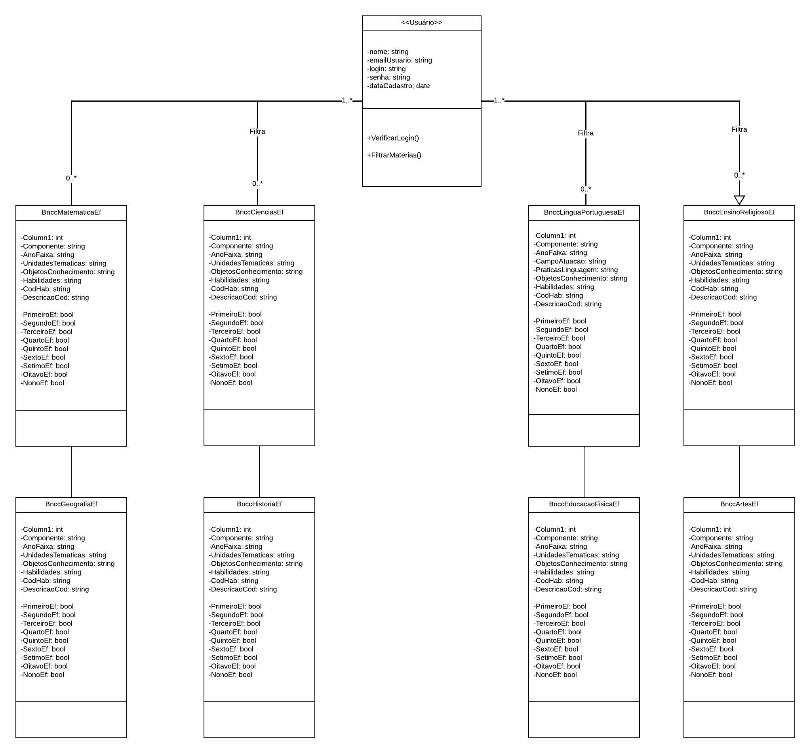
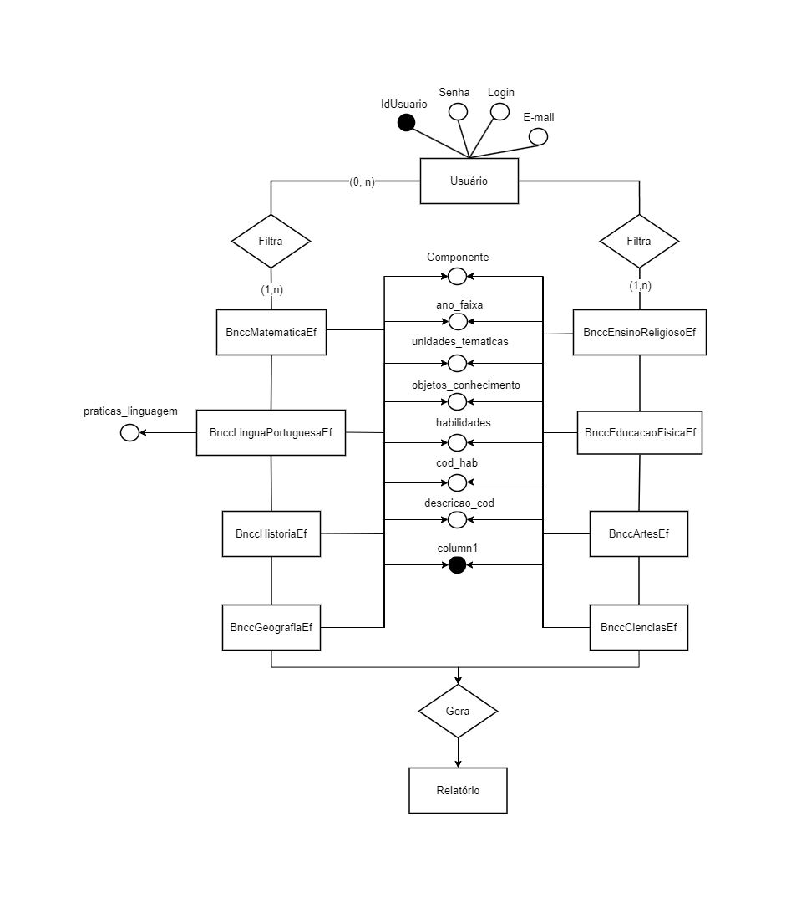
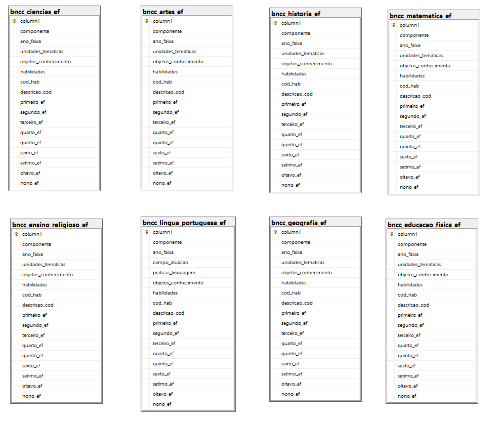
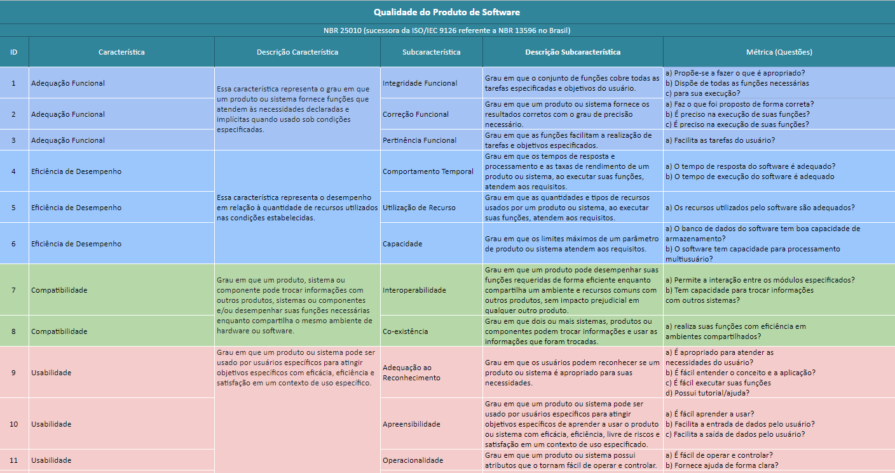
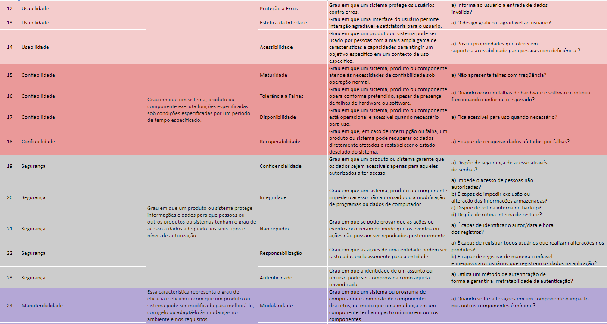
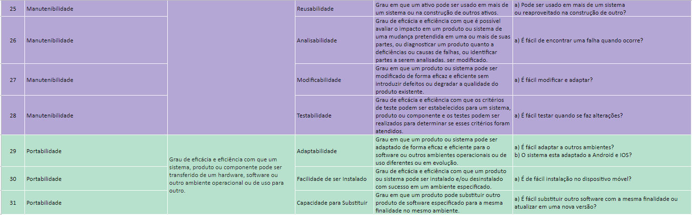
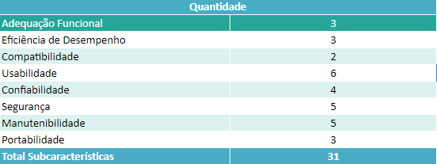

# Arquitetura da Solução

Pré-requisitos: <a href="3-Projeto de Interface.md"> Projeto de Interface</a>

Definição de como o software é estruturado em termos dos componentes que fazem parte da solução e do ambiente de hospedagem da aplicação.

## Diagrama de Classes

Na imagem abaixo é apresentado o diagrama de classes do projeto.

---
## Modelo ER

O Modelo ER representa através de um diagrama como as entidades (coisas, objetos) se relacionam entre si na aplicação interativa.

---
## Esquema Relacional

O Esquema Relacional corresponde à representação dos dados em tabelas juntamente com as restrições de integridade e chave primária.

Na figura abaixo é mostrado o Esquema Relacional(ER) desenvolvido no próprio banco de dados para o projeto.

---
## Modelo Físico

O Modelo fisico do Banco de dados se encontra no link abaixo.

> **Link**:
> - [SQL Script](https://github.com/GuruDevOp7884/pmv-ads-2023-1-e3-proj-mov-t6-grupo7-planejamento-bncc/tree/main/docs/sqlScripts)
>---

---
## Tecnologias Utilizadas

<b>IDEs:</b>
- `Visual Studio 2022`
- `Visual Studio Code`

<b>Linguagens:</b>
- `C#`
- `Css`
- `JavaScript`

<b>Frameworks:</b>
- `React Native` 
- `Asp.net Core `
- `EntityFramework.`
  
<b>Banco de dados:</b> 
- `Microsoft SQL Server`
- `Firebase`
  

---
## Hospedagem

Explique como a hospedagem e o lançamento da plataforma foi feita.

> **Links Úteis**:
>
> - [Website com GitHub Pages](https://pages.github.com/)
> - [Programação colaborativa com Repl.it](https://repl.it/)
> - [Getting Started with Heroku](https://devcenter.heroku.com/start)
> - [Publicando Seu Site No Heroku](http://pythonclub.com.br/publicando-seu-hello-world-no-heroku.html)

---
## Qualidade de Software

A medida que a tecnologia avança vem se tornando cada vez comum a priorização da qualidade de software, podendo determinar até o sucesso de um negócio. Atualmente não basta apenas satisfazer o pedido do cliente para "desenvolver algo que funcione corretamente", mesmo que tenha sido altamente avaliado em termos de qualidade, mas nos últimos anos o nível de demanda do lado do cliente vem subindo, como por exemplo: "eu quero algo que não só funcione corretamente, mas que possa ser usado e satisfatório".

Por isso, para alcançar a qualidade que satisfaça os clientes, está se tornando cada vez mais importante analisar as expectativas desses diversos clientes, examinar os requisitos de qualidade que devem ser perseguidos e prosseguir com o desenvolvimento. Existem diferentes expectativas de qualidade para cada stakeholder, as expectativas para os produtos diferem dependendo de cada posição, por isso é muito importante compreender firmemente que tipo de qualidade cada stakeholder está procurando.

Desta forma, as expectativas para a qualidade do software cobrem não apenas a funcionalidade, mas também a facilidade de uso, estabilidade e facilidade de operação e manutenção. Por essa razão, não é fácil identificar todas as demandas das partes interessadas e atender suas expectativas sem falhas.

Portanto, existem vários indicadores como um dos padrões de definição e organização de requisitos de qualidade tão diversos, mas desta vez apresentaremos o padrão internacional "ISO/IEC 25010:2011" para avaliar a qualidade do software. Este padrão classifica as características de qualidade do software nas seguintes oito categorias e 31 subcategorias presentes na imagem a seguir:

---
Com base nessas características escolhemos algumas para focar no nosso projeto:

