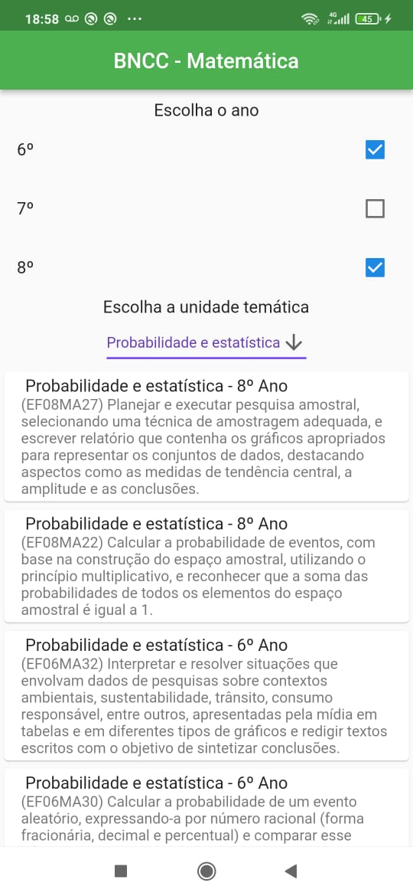
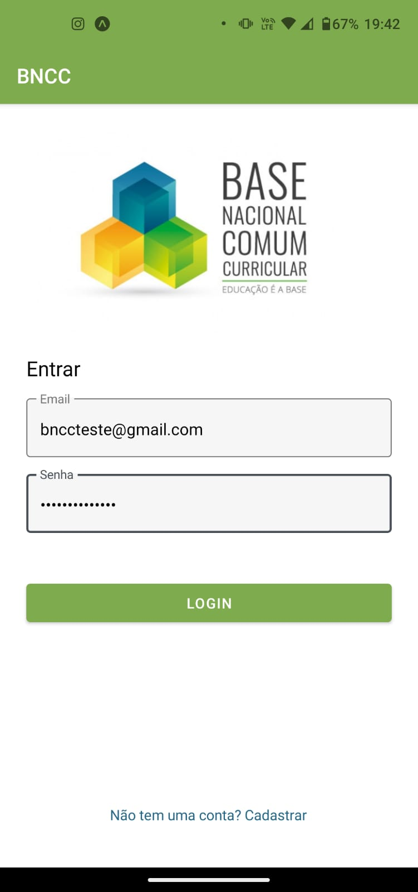

# Programação de Funcionalidades

## Funcionalidades do Sistema  

Nesta seção é apresentada uma funcionalidade desenvolvida para o sistema, que é a visualização do banco de dados e filtragens. 

 ## Visualização do banco de dados  

  

A tela principal do sistema apresenta o banco de dados com opções para filtragem. Esse banco de dados já está disponível no Firebase e também em SQL, e a utilização de um ou outro vai depender dos resultados de sua implementação em futuras entregas deste trabalho. Nesse exemplo, foi utilizado o Firebase.  

Há duas opções de filtragens. Na primeira, o usuário seleciona o ano que deseja ver o currículo, com distintas possibilidades de combinação. Na segunda, é gerado automaticamente um menu dropdown dinâmico cujas entradas, armazenadas em um conjunto, refletem os diferentes conteúdos, chamados “unidades temáticas” a serem trabalhados na disciplina de Matemática. A figura a seguir mostra uma filtragem com os dois filtros selecionados.

---

Nessa outra figura, é possível ver as opções geradas automaticamente pelo menu dropdown. A cada matéria selecionada, uma filtragem específica que contemple apenas esses itens é gerada.  

---

Ja nessa figura, é possivel ver um protótipo da tela de login do app

