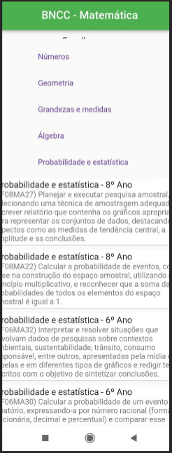

# Registro de Testes de Software

| Testes 	| CT 01 – Efetuar login |
|:---:	|:---:	|
https://user-images.githubusercontent.com/88688861/236684169-2ae988a3-da30-4a62-aa54-11fe4341bd55.mp4

| Testes 	| CT 02 – Filtrar Ensino Fundamental |
|:---:	|:---:	|

`Em implementação` 

| Testes 	| CT 03 – Filtrar Ano/Série/Faixa etária |
|:---:	|:---:	|

`Em implementação` 

| Testes 	| CT 04 – Filtrar por matérias |
|:---:	|:---:	|
`Em implementação` 

| Testes 	| CT 05 – Filtrar por habilidades |
|:---:	|:---:	|

| Testes 	| CT 06 – Visualizar tabela com os filtros |
|:---:	|:---:	|

`Em implementação` 
  
| Testes 	| CT 07 – Efetuar download do relatório com o conteúdo filtrado |
|:---:	|:---:	|

`Em implementação` 

---

## Avaliação

Todas as funcionalidades feitas até o momento funcionam perfeitamente, faltando apenas implementar as que faltam para a aplicação
